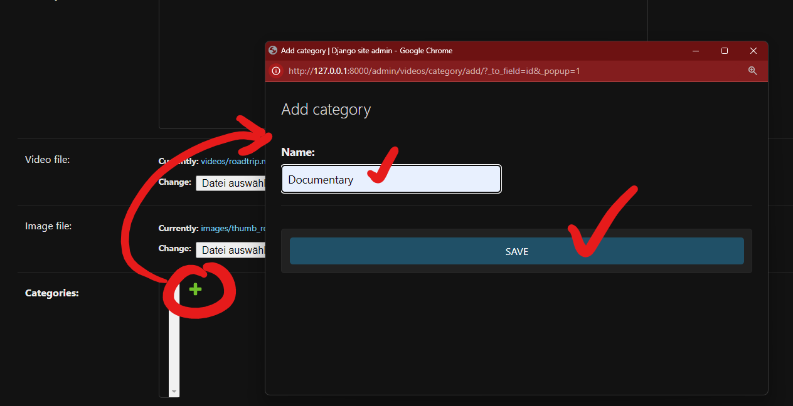

# Videoflix Backend
Public repository: https://github.com/alsiesta/videoflix-bknd

Videoflix is a backend service for a video streaming platform. This project is built using Django and it provides various features such as user registration, password reset, video management, and more.

This app has a frontend app you can find here: https://github.com/alsiesta/videoflix


## Features

- **User Management**: Registration, login, and password reset functionalities.
- **Video Management**: Upload, manage, and stream videos.
- **Email Notifications**: Send emails for registration and password reset.
- **Redis Queue**: Background task processing using Redis.
- **REST API**: Expose endpoints for frontend interaction.
- **Admin Interface**: Manage users, videos, and other data through Django's admin interface.

## Prerequisites
**Dev:**
- Python 3.12
- *"WSL active on you Windows Mashine"* or you work on Linux

**Production:**
- Python 3.12
- Ubuntu 20.04.6 LTS
- postgresql postgresql-contrib
```
sudo apt update

#install Ubuntu 20.04 LTS
sudo apt install software-properties-common -y
sudo add-apt-repository ppa:deadsnakes/ppa
sudo apt update

# install python
sudo apt install python3.11

# set default python version
sudo update-alternatives --install /usr/bin/python3 python3 /usr/bin/python3.11 1

# install postgreSQL
sudo apt install postgresql postgresql-contrib

# Check Installation
psql --version #checks PostgrSQL Version
lsb_release -a  #checks Ubuntu Instance
```

## Setup
Rename the **'.env_example'** file to **'.env'**
For review purposes by the "Developer Akademie" I left my personal credentials in this file like so: 

```
//.env
EMAIL_HOST_USER = 'schoenfeldalexander@googlemail.com'
EMAIL_HOST_PASSWORD = 'ktmw rklg aurw fder'
DJANGO_DEBUG=True
DEV_HOST='http://localhost'
PROD_HOST='http://mysite.com'
FRONTEND_HOST='localhost:4200'
```


## Setup & Starting the App
**A.** Open the WSL (Ubuntu/Bash) shell at Root Directory level.

**B.** Then either run `source start.sh` or `./start.sh`.
(The first command keeps the virtual environment visible in the terminal during the installation process. The second runs the installation in a subshell. The results are identical.)

**<span style="color:red;">Note:</span>** It is possible that you have edit the line endings of the start.sh file, when you get an error in the shell. Then run the following command in bash: `dos2unix start.sh`. Afterwards, run the script again. It should work.
Install the tool if you don't have it with: `sudo apt install dos2unix`


**IMPORTANT:** 
- **Step 5** during installation you have to submit a name for the PostgreSQL database. Name it **"videoflix_db"** 
- **Step 9** may take 4-5 minutes!
- **Step 11** during installation you also have to give the superuser a **name, email and password**.
- When the backend is up and running, you have to upload minimum one video to the backenend **AND** you have to define and add a "Movie Category" of your choice (s. screenshot): 


That's it.

________________

### What happens during installation:
1. **Upgrading apt package manager**
2. **Installing all required packages like:** postgresql, postgresql-contrib, expect, python3-venv
3. **Starting the PostgreSQL service in your WSL**
4. **Setting the PostgreSQL default user password to "Test123"**
5. **Creation of PostgreSQL database**
   1. When prompted to give the db a name type: **"videoflix_db"**
6. **Listing the PostgreSQL databases for controlling**
7. **Creation of the virtual environment "myvenv"**
8. **Starting the virtual environment**
9. **Installation of all dependencies into the Virtual Environment**
10. **Migrating the Django DB to PostgreSQL DB**
11. **Creating Django Admin Superuser**
    1.  When prompted submit a **username, email, password**
12. **Starting Redis Que Worker in a subshell**
    1.  this will run the Video Formating Processes in parallel and
    2.  it runs the Cache
13. **Checking if port 8000 is available**
14. **Starting the Django Backend-Server on port 8000**
15. If you started the script with "source start.sh" the Django Admin UI will open in your browser under: http://127.0.0.1:8000/admin


### Note:
In the settings.py file of the Django App, the Database Settings should look like so now. The password is setting during installation. The name is set by yourself during installation and it should be = "videoflix_db"
   ```
   DATABASES = {
       'default': {
           'ENGINE': 'django.db.backends.postgresql',
           'NAME': 'videoflix_db',
           'USER': 'postgres',
           'PASSWORD': 'Test123',
           'HOST': 'localhost',
           'PORT': '5432',
       }
   }

   ```


